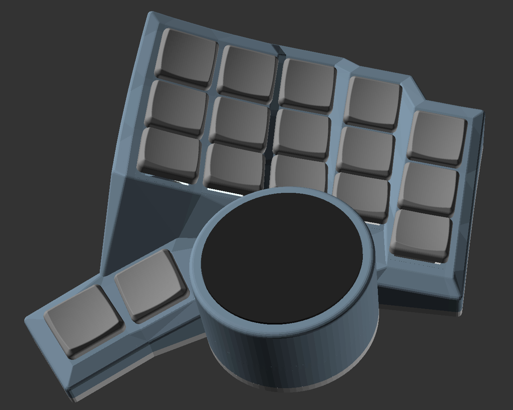

# Sphynx keyboard

Sphynx is a parametric split ergonomic keyboard with columnar stagger and splay. It is fully configurable to adjust the shape to fit your hands. Cirque trackpads and rotary encoders can also be added in place of the outer thumb key.

I have written this from scratch in TypeScript, but the code is heavily influenced by and sections ported from the Clojure:

- Josh Bertrand's [Dactyl Manuform](https://github.com/abstracthat/dactyl-manuform)
- Okke Formsma's [Dactyl Manuform Tight](https://github.com/okke-formsma/dactyl-manuform-tight/)

The layout is roughly based on Quentin Le Bastard's [Charybdis Nano](https://github.com/Bastardkb/Charybdis), which has been my daily driver for some time.

This repository is a fork of Richard Wang's [Openscad-ts](https://github.com/richardwa/openscad-ts). Thanks Richard, this has made modelling with TypeScript a really pleasant dev experience.

## Usage

1. Check out this project with `git clone git@github.com:pixelbreaker/sphynx-split-ergo.git`
2. Run `npm install`
3. Run `npm watch`
4. start editing files under projects, scad files will output into "/target" folder
5. open openscad on the generated file
   - turn on "Automatic review and preview" mode
   - changes to the projects files will automatically propagate to openscad

### Attribution

Some of the 3D models used are from Thingiverse and under [Creative Commons Attribution License](https://creativecommons.org/licenses/by-nc/4.0/)

The models are:

- [EC11 encoder switch plate adapter](https://www.thingiverse.com/thing:3770166)
- [MBK Choc keycaps](https://www.thingiverse.com/thing:4564253)
- [SA Keycaps](https://www.thingiverse.com/thing:4283287)
- [XDA Keycaps](https://www.thingiverse.com/thing:4593219/files)
